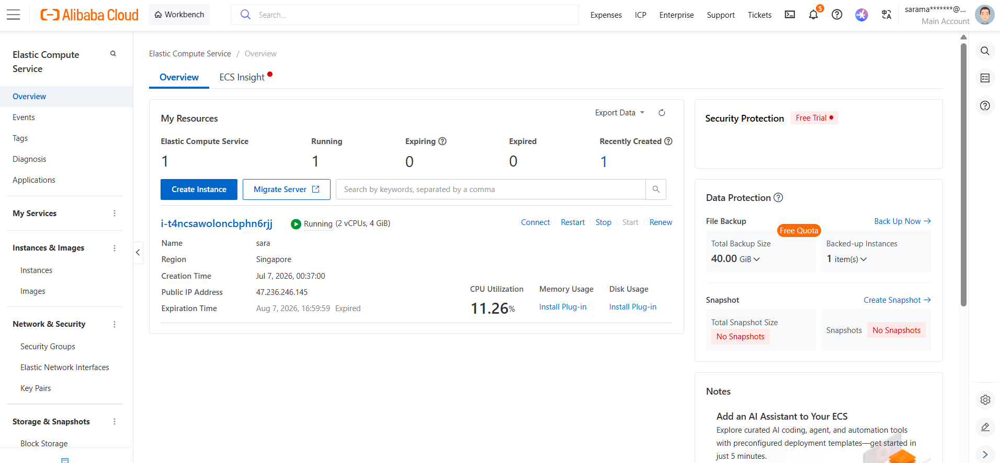

# CrisisDesk

[](./LICENSE)

**Qwen Cloud Hackathon — Track 3: Agent Society**

Multi-agent AI dispatch simulation (Triage → Allocator ↔ Auditor → Liaison) benchmarked
against a single-agent baseline, built on the Qwen API.

## Proof of Deployment

Your project must be, at some point, fully deployed and running on Alibaba Cloud — not just sketched in Figma, not just running locally. Proof is shown in two places:

**In the code repo:**

A link to a code file that clearly uses Qwen Cloud APIs: [`backend/orchestrator/orchestrator.py`](backend/orchestrator/orchestrator.py)

Base URL used (matches the required OpenAI-compatible endpoint):

```
https://dashscope-intl.aliyuncs.com/compatible-mode/v1
```

Every Triage, Allocator, Auditor, Liaison, and single-agent-baseline call in this project routes through that endpoint via the `AsyncOpenAI` client configured near the top of `orchestrator.py`.

**Visual evidence:**

A screenshot of running resources from the Alibaba Cloud Workbench:



*(Screenshot of the ECS instance in the Alibaba Cloud console/Workbench, showing it in the "Running" state with its public IP visible — saved at `docs/alibaba-cloud-screenshot.png`.)*

**Live deployment:** the backend runs on an Alibaba Cloud ECS instance at `http://47.236.246.145:8000` — see [Deployment](#3-deploy-to-alibaba-cloud-ecs) below for the exact setup.

## Project layout

```
main.py                    # entrypoint
requirements.txt
.env.example
backend/
  api/routes.py            # FastAPI routes + websocket
  agents/agents.py         # prompt builders + response parsers for each agent role
  orchestrator/
    orchestrator.py        # the actual multi-agent / single-agent pipelines
    benchmark.py            # benchmark scenario runner + quality scoring
  simulation/world.py       # incident types, rulebook, map/scenario generation
  db/database.py            # SQLite persistence
frontend/
  index.html                 # the whole dashboard (map, timeline, benchmark, live session)
  logo1.png                  # logo — served at /static/logo1.png
docs/
  architecture.svg           # architecture diagram
  alibaba-cloud-screenshot.png   # proof-of-deployment screenshot
data/                       # SQLite database lives here at runtime (gitignored)
```

## 1. Local setup

```bash
python3 -m venv .venv
source .venv/bin/activate          # Windows: .venv\Scripts\activate
pip install -r requirements.txt

cp .env.example .env
# edit .env and paste your real QWEN_API_KEYs

python main.py
```

Visit `http://localhost:8000`.

## 2. Push to GitHub

```bash
git init
git add .
git commit -m "CrisisDesk — multi-agent dispatch simulation"
git branch -M main
git remote add origin https://github.com/<your-username>/<your-repo>.git
git push -u origin main
```

`.gitignore` already excludes `.env` and the SQLite database — double-check
`git status` before your first commit that no real API key is staged.

## 3. Deploy to Alibaba Cloud (ECS)

These steps assume a plain Ubuntu ECS instance you can SSH into.

### 3.1 Server prerequisites

```bash
sudo apt update
sudo apt install -y python3-venv python3-pip git
```

### 3.2 First-time setup

```bash
cd /root
git clone https://github.com/<your-username>/<your-repo>.git crisisdesk
cd crisisdesk
python3 -m venv .venv
.venv/bin/pip install -r requirements.txt
cp .env.example .env
nano .env       # paste your real QWEN_API_KEY, save (Ctrl+O, Enter), exit (Ctrl+X)

nohup .venv/bin/python3 main.py > app.log 2>&1 &
disown
```

`nohup` + `disown` keep the app running after you close the SSH session.
`app.log` captures anything it prints — check it if something looks wrong:
`tail -f app.log`.

### 3.3 Open the firewall

In the Alibaba Cloud console: Security Groups → your instance's group →
Add Rule → TCP, port **8000**, source `0.0.0.0/0`.

Visit `http://<your-ECS-public-IP>:8000`.

### 3.4 Redeploying after a new push

```bash
cd /root/crisisdesk
git pull
pkill -f main.py
.venv/bin/pip install -r requirements.txt   # only if requirements.txt changed
nohup .venv/bin/python3 main.py > app.log 2>&1 &
disown
```

`nohup` + `disown` keep the app running after you close the SSH session — it
won't auto-restart on a server reboot, but that's not a concern for the
duration of the hackathon judging window.

## Architecture


### Components

**Frontend (`frontend/index.html`)** — a single static file (HTML/CSS/vanilla JS,
no build step) served directly by FastAPI at `/static`. Four tabs: Live Map
(canvas-rendered city grid with incident markers), Timeline (per-incident agent
reasoning trail, or a combined "stacked" view across every run), Benchmark
(quality scoreboard + downloadable report), and the Live Session sidebar
(declare incidents on demand, adjust resource counts, stop/reset). It talks to
the backend two ways: REST for actions (`fetch(...)`) and a persistent
WebSocket (`/ws/live`) for the live agent-reasoning feed — every `agent_step`,
`incident_triaged`, `conflict`, `tie_break`, and `incident_resolved`/`escalated`
event streams to the browser the moment it happens on the backend.

**FastAPI backend (`backend/api/routes.py`)** — exposes the REST surface
(`/api/run`, `/api/compare`, `/api/live/declare`, `/api/live/stop`,
`/api/live/reset`, `/api/runs/*`) and the WebSocket connection manager that
broadcasts orchestrator events to every connected browser tab. Benchmark runs
and live-declared batches are both wrapped in cancellable `asyncio.Task`s so
the Stop button can interrupt either one mid-flight.

**Orchestrator (`backend/orchestrator/orchestrator.py`)** — the actual agent
pipeline. For a batch of simultaneously-arriving incidents:
1. **Triage** runs on every incident *concurrently* (`asyncio.gather`) — real
   parallel Qwen calls, not a sequential loop, so incidents genuinely compete
   for attention at the same moment instead of being handled first-come-first-served.
2. Incidents are then sorted **by severity, most critical first**. When two
   incidents tie on severity *and* need the same resource type — meaning
   they're genuinely competing for the same scarce pool — the tie is broken
   by whichever has the fastest reachable matching resource right now, and
   that reasoning is logged as a `tie_break` system message so it's visible
   in the Timeline and the downloadable report.
3. For each incident in that order: the **Allocator** proposes a specific
   resource; the **Auditor** checks the proposal against the hard rulebook
   (no double-assignment, no LOW-tier resource grabs while a CRITICAL
   incident is unresolved, resource type must match, every incident must end
   in a dispatch or an explicit escalation) and can reject it, forcing the
   Allocator to revise — this reject/revise loop is logged as a `conflict`
   and streamed live.
4. Once approved, the **Field Liaison** writes the actual dispatch
   instructions and the resource is marked busy.

**Single-agent baseline (same file)** — the comparison arm: one Qwen call per
incident, handling severity assessment, resource choice, and dispatch text
all at once, processed strictly in arrival order with no batch triage and no
auditor cross-check. This asymmetry is deliberate — it's what makes the
benchmark actually measure the value of decomposing the task across roles,
rather than comparing two systems that behave identically.

**Benchmark & quality scoring (`backend/orchestrator/benchmark.py`)** — runs
the same seeded scenario (same incidents, same resource pool) through both
pipelines and scores each one 0–100 on three components: rule compliance
(deductions for genuine priority violations — only counted when two incidents
actually compete for the *same resource type*, not just any two incidents),
resolution rate, and escalation accuracy (whether an escalation was actually
justified, verified against the real resource-availability count logged at
that moment, not just trusted blindly).

**Simulation world (`backend/simulation/world.py`)** — defines the incident
type table (label, base severity, required resource type), the hard rulebook
text shared by every agent's prompt, and the seedable random scenario
generator (same seed ⇒ identical incidents/resources for both arms of a
comparison; different seed ⇒ a different map and mix each time).

**Persistence (`backend/db/database.py`)** — SQLite with six tables:
`incidents`, `resources`, `agent_messages` (the full reasoning trail, one row
per agent turn), `conflicts` (Auditor rejections), `dispatches`, and
`benchmark_runs` (aggregate metrics per run). No ORM — plain parameterized
SQL, one short-lived connection per call.

**Qwen Cloud (Alibaba Cloud)** — every agent call goes through an
`AsyncOpenAI` client pointed at Alibaba Cloud's Dashscope OpenAI-compatible
endpoint (see [Proof of Deployment](#proof-of-deployment) above). Optionally,
each agent role can be given its own API key via `.env`
(`QWEN_API_KEY_TRIAGE`, `_ALLOCATOR`, `_AUDITOR`, `_LIAISON`, `_SINGLE`) so
concurrent calls from different roles don't compete for the same account's
rate limit — a semaphore (`QWEN_MAX_CONCURRENCY`) and exponential-backoff
retry sit in front of every call as well.

### Request lifecycle example — Full Comparison

1. Browser `POST /api/compare` → backend builds one seeded scenario (shared
   incidents + resources)
2. Runs it through the multi-agent pipeline (steps 1-4 above), streaming
   every step over the WebSocket
3. Runs the *same* scenario through the single-agent baseline
4. Computes quality scores for both, persists them to `benchmark_runs`
5. Returns both results + a computed diff to the browser, which renders the
   side-by-side scoreboard and (if requested) a downloadable Markdown report
   with the full reasoning trail for every incident in both arms

## Notes

- The SQLite database lives at `data/crisisdesk.db` — back it up before big
  changes if you care about run history; it's gitignored so it won't be
  overwritten by a `git pull`.
- `DEV_MODE=1` in `.env` enables uvicorn's autoreload for local development —
  leave it unset in production.
